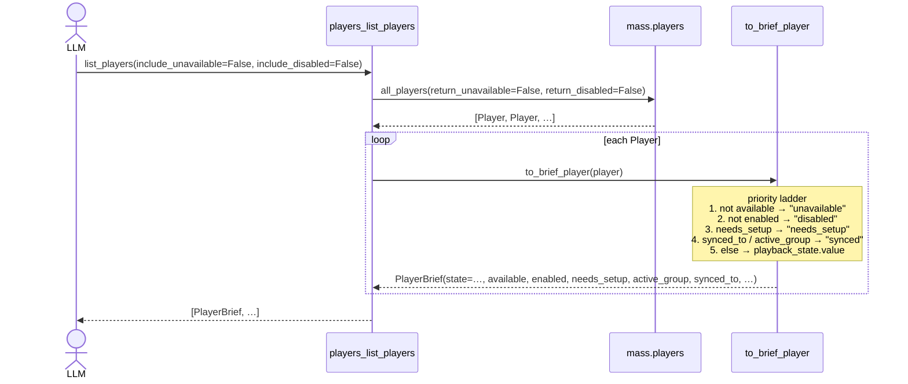

## Problem Statement

After v0.3.30 closed the "offline players look identical to quiet
players" gap, four parallel gaps remain that leave LLM callers unable
to triage devices correctly:

1. A `Player.needs_setup=True` device is reachable but cannot play —
   the LLM picks it, `play_media` fails.
2. A device synced to an active group (`Player.synced_to` or
   `active_group` set) physically streams the group's audio, but its
   own `playback_state` stays `idle` — indistinguishable from a quiet
   speaker.
3. `enabled` was added to `PlayerBrief` in v0.3.30 but MA filters
   `disabled` players out of `all_players()` by default, so the field
   is always `True` — dead code with no way to surface disabled
   devices.
4. `PlayerQueue.available` exists upstream but `QueueBrief` doesn't
   expose it — the same triage problem v0.3.30 solved for players is
   still open for queues.

In addition, the `now_playing_summary` prompt still tells the LLM to
"List all players via players_list_players" — but the tool no longer
lists all by default after v0.3.30. If every speaker is offline the
LLM gets `[]` and reports "no players configured".

## Solution Summary

Expose three new MA-side fields (`needs_setup`, `active_group`,
`synced_to`) on `PlayerBrief`, expose `available` on `QueueBrief`,
and extend `to_brief_player`'s `state` synthesis so every blocker
surfaces as a single `state` value the LLM can act on. Add an
`include_disabled` knob to `list_players` mirroring
`include_unavailable`. Rewrite the `now_playing_summary` prompt to
reflect the new default filter. Tighten three fragile tests carried
over from v0.3.30.

## Acceptance Criteria

1. `PlayerBrief` gains `needs_setup: bool = False`, `active_group: str
   | None = None`, `synced_to: str | None = None`, all back-compat
   safe.
2. `to_brief_player` synthesises a new `state` value when any of the
   blocker fields signals unusability, with the priority chain
   `unavailable > disabled > needs_setup > synced > playback_state`.
3. `QueueBrief` gains `available: bool = True` and `to_brief_queue`
   reads `queue.available`.
4. `list_players` accepts `include_disabled: bool = False`; default
   matches MA's own `return_disabled=False` so existing callers see
   identical output.
5. `now_playing_summary` prompt explains the default filter and notes
   that `state="synced"` means the queue belongs to the group leader.
6. Three fragile tests from v0.3.30 are tightened: equality test
   pins new defaults explicitly; exposure test asserts `state` in
   addition to fields; `mounted_players` fixture has a `yield`-based
   teardown hook ready for future FastMCP lifecycle methods.

## Test Plan

- **Unit (`tests/test_models.py`)**:
  - Parametrised state-override matrix covering each blocker in
    isolation (5 cases: unavailable, disabled, needs_setup,
    `synced_to`-set, `active_group`-set).
  - Priority test with multiple blockers set simultaneously; asserts
    the most-blocking value wins.
  - Field-readthrough tests pin `to_brief_player` reads the three
    new MA-side fields and defaults safely when absent.
  - `to_brief_queue` exposes `available`; defaults to `True` when
    the queue stub lacks the attribute.
- **Tool (`tests/test_players_tool.py`)**:
  - `include_disabled=True` forwards `return_disabled=True` to
    `mass.players.all_players`; default omits it (or sends `False`).
  - Synced player stub round-trips with `state="synced"` through the
    MCP `Client`.
  - `needs_setup=True` stub round-trips with `state="needs_setup"`.
- **Resource (`tests/test_resources.py`)**:
  - `player://{id}` JSON includes `state="synced"` for a synced
    stub and `state="needs_setup"` for an unconfigured stub.
- **Manual MCP verification** (against running MA):
  - `players_list_players` shows three new fields populated.
  - Lenco LS-500 + Kitchen (synced to Sendspin BT group) report
    `state="synced"` and `active_group="syncgroup_namklkxy"`.

## Sequence Diagram

The ladder is short-circuit: the first matching blocker wins and the
chain stops. Tests pin both the per-rung behaviour and the priority
order (a player that is both offline and synced reports
`"unavailable"`, not `"synced"`).
