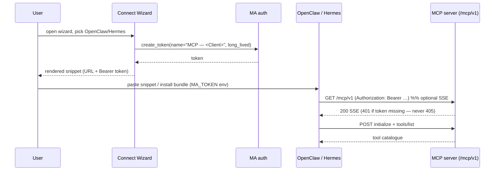

## Problem Statement

The Connect Wizard ships copy-paste presets for ten AI clients (Claude
Code/Desktop, Cursor, Windsurf, VSCode, ChatGPT, Codex, Gemini, Cline,
Zed), but not for the two multi-agent orchestrators users increasingly run
in front of Music Assistant: **OpenClaw** and **Hermes** (Nous Research).
A user wiring either one up today has to hand-write the config, look up the
right field names, and mint a token manually — every step a chance to get
the transport or the `Authorization` header wrong. There is also no
one-step distribution artifact for OpenClaw, whose plugin/bundle ecosystem
expects an installable bundle that pre-declares the MCP server.

## Solution Summary

Add two Connect Wizard presets — OpenClaw (a `openclaw mcp set …` shell
one-liner) and Hermes (a `~/.hermes/config.yaml` block) — so the wizard
mints a per-client token (`MCP — OpenClaw` / `MCP — Hermes`) and renders a
ready-to-paste snippet exactly as it does for existing clients. Separately,
ship an installable **OpenClaw plugin bundle** under `packaging/openclaw/`
(Claude-format: `.claude-plugin/plugin.json` + `.mcp.json` + a light
`SKILL.md`) that pre-declares the Music Assistant MCP server over
streamable-HTTP with the token supplied via the `${MA_TOKEN}` environment
variable. Both paths reuse the server's existing streamable-HTTP transport
and bearer-token auth — no runtime/server code changes.

## Acceptance Criteria

1. The wizard catalogue (`/connect/info` `clients`) includes an `openclaw`
   entry whose rendered snippet is a valid `openclaw mcp set ma '<json>'`
   command where the embedded JSON has `transport: "streamable-http"`, the
   wizard URL, and `Authorization: "Bearer <token>"`.
2. The wizard catalogue includes a `hermes` entry whose rendered snippet is
   valid YAML declaring `mcp_servers.ma.url` and
   `mcp_servers.ma.headers.Authorization` = `Bearer <token>`.
3. Both presets carry the per-client mint contract: rendering substitutes
   both `{{URL}}` and `{{TOKEN}}`, and the minted token is named
   `MCP — OpenClaw` / `MCP — Hermes` (existing `MCP — <label>` rule).
4. The client-spec integrity invariant accepts the new `yaml` snippet kind
   without weakening the `{{URL}}` + `{{TOKEN}}` requirement for any spec.
5. `packaging/openclaw/.mcp.json` parses as JSON, declares server `ma` with
   `transport: "streamable-http"` and `Authorization: "Bearer ${MA_TOKEN}"`,
   and `packaging/openclaw/.claude-plugin/plugin.json` parses as JSON with a
   non-empty `name`.
6. A regression guard pins that the server's MCP endpoint treats `GET` as a
   handled method (HTTP 401 without auth — **not** 405), so OpenClaw's
   bundle-mcp client (which opens the optional `GET` SSE stream before
   `POST initialize`, OpenClaw issue #72757) is not tripped by a POST-only
   405.

## Test Plan

- `tests/test_connect_wizard.py::test_openclaw_template_round_trips` —
  render the `openclaw` spec, extract the JSON argument from the
  `openclaw mcp set ma '…'` command, `json.loads` it, assert
  `url`, `transport == "streamable-http"`, `Authorization == "Bearer …"`.
- `tests/test_connect_wizard.py::test_hermes_template_round_trips` —
  render the `hermes` spec, `yaml.safe_load`, assert
  `mcp_servers.ma.url` and `headers.Authorization`.
- Extend `test_all_clients_have_required_fields` to allow `kind == "yaml"`
  and confirm the catalogue still has ≥ 10 entries.
- `tests/test_openclaw_bundle.py` — static validation of the bundle:
  `.mcp.json` and `plugin.json` parse; the `ma` server entry has the
  streamable-HTTP transport and `${MA_TOKEN}` bearer header; `plugin.json`
  has a non-empty `name`.
- `tests/test_e2e_http.py` (or equivalent) — assert an unauthenticated
  `GET` to the mounted MCP endpoint returns 401, never 405 (AC 6).
- Manual: install the bundle into a live OpenClaw (`openclaw plugins
  install`), set `MA_TOKEN`, confirm `ma` tools load — gated before the
  ClawHub `package publish` release step.

## Sequence Diagram

