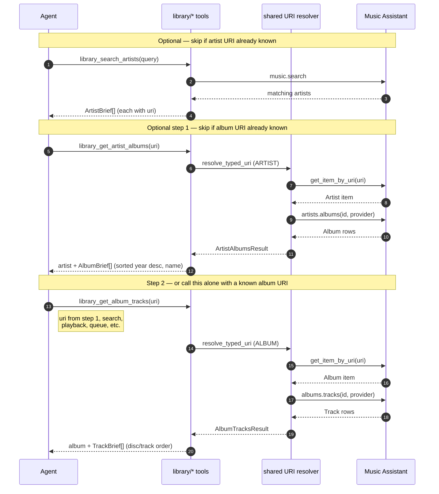

## Problem Statement

MCP agents can search and list library items, but turning a Music Assistant URI
into structured data—or walking album→tracks / artist→albums—requires
re-scraping search results or guessing controller APIs. Wrong media types on a
URI silently return the wrong brief shape, and URI lookup errors are opaque.

## Solution Summary

Add read-only library tools that resolve a URI to the correct typed Brief,
plus drill-down tools for album track listings and artist discographies. Shared
URI resolution moves into the common helper layer with distinct ToolError
messages for not-found, malformed, and offline-provider cases.

## Acceptance Criteria

1. Five `library_get_*_by_uri` tools return typed Briefs and reject media-type
   mismatches with a recovery hint naming the correct tool.
2. `library_get_album_tracks` returns album + tracks sorted by disc/track
   number; unavailable tracks are omitted.
3. `library_get_artist_albums` returns artist + albums sorted by year (desc)
   then name; unavailable albums are omitted.
4. `TrackBrief` includes optional `disc_number` and `track_number` for
   drill-down ordering context.
5. Media and metadata tools reuse the shared resolver instead of duplicating
   lookup logic.

## Test Plan

- `tests/test_media_resolve.py` — resolver error classes, typed mismatch hints,
  and Brief conversion for each media type.
- `tests/test_library_album_tracks.py` — album/artist drill-down ordering and
  filtering of unavailable items.
- Manual: call `library_get_album_tracks` with a known album URI via MCP
  client and confirm track order matches the MA UI.

## Sequence Diagram

**Example flow only** — one way an agent might walk the library when it starts
with only a name. Each step is independent: depending on prior context the agent
may skip search, call only ``library_get_artist_albums`` when it already holds
a URI, or call ``library_get_album_tracks`` directly when it already holds one
(from search, playback state, queue rows, or a prior ``AlbumBrief``).

``library_get_*_by_uri`` tools are another entry point: they return a single
Brief (and docstrings point to the drill-down tools) but do not replace the
two-step listing when the agent needs full album or track sets.
