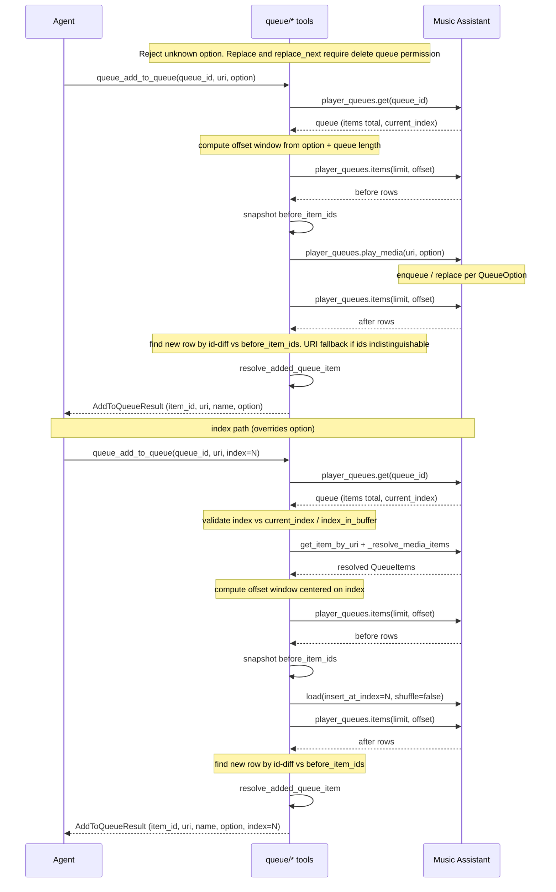

## Problem Statement

Agents can start playback via ``playback_play_media`` but have no dedicated way
to enqueue media without interrupting what is already playing. Queue placement
modes (append, play next, replace) exist in Music Assistant but are not exposed
through MCP, forcing agents to guess controller APIs or misuse playback tools.

## Solution Summary

Add ``queue_add_to_queue`` under the ``edit:queue`` permission with explicit
``option`` values mapped to MA ``QueueOption``, plus an optional ``index`` for
absolute-position inserts. Return ``AddToQueueResult`` so callers can confirm
the new row before chaining adds. Gate ``replace`` / ``replace_next`` on
``delete:queue``, mark the tool destructive, and resolve the added row via
id-diff with a tail window for long queues.

## Acceptance Criteria

1. ``add_to_queue`` accepts ``add``, ``next``, ``play``, ``replace_next``, and
   ``replace``; invalid options raise ``ToolError`` listing valid values.
2. Default ``option`` is ``add``; the call forwards to
   ``player_queues.play_media`` with the matching ``QueueOption``.
3. Successful adds return ``AddToQueueResult`` with ``item_id``, ``uri``,
   ``name``, and ``option``.
4. ``replace`` and ``replace_next`` require ``delete:queue`` when that
   permission is disabled on the runtime.
5. Row detection prefers newly created ``queue_item_id`` values; album URIs
   that expand to track rows are detected by id-diff, not input URI match.
6. Queues longer than 500 items use a tail window offset when locating appended
   rows.
7. Optional ``index`` inserts at an absolute 0-based queue position via
   ``player_queues.load(insert_at_index=…)``; overrides ``option`` placement,
   never starts playback, and rejects indices at/before the current or buffered
   row. ``replace`` / ``replace_next`` cannot be combined with ``index``.
8. When ``index`` is used, ``AddToQueueResult.index`` echoes the requested
   insertion position.

## Test Plan

- ``tests/test_add_to_queue.py`` — valid/invalid options, default, ack payload,
  id-diff for duplicates and album expansion, tail window, delete permission gate,
  index validation, index load path, album expansion at index.
- ``tests/test_annotations.py`` — ``queue_add_to_queue`` listed as destructive.
- Manual: call ``queue_add_to_queue`` with a track URI and ``option=next`` while
  playback is active; confirm the current item keeps playing and the new row
  appears immediately after it in the queue (play-next placement, not tail append).
- Manual: call ``queue_add_to_queue`` with ``index`` while playback is active;
  confirm the row lands at the requested slot without interrupting playback.

## Sequence Diagram

