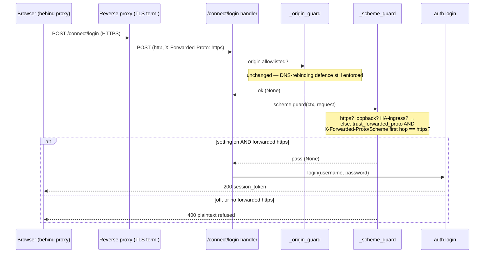

## Problem Statement

Behind a TLS-terminating reverse proxy (nginx, Nginx Proxy Manager, Traefik,
Caddy, …) the Connect Wizard cannot mint tokens. The proxy terminates HTTPS and
forwards the request to Music Assistant over a plain-HTTP local socket, so MA's
own transport sees `http` from a public (non-loopback) host. The wizard's
plaintext-credential guard then rejects `/connect/login`, `/connect/exchange`,
and `/connect/token` with *"Plaintext credential traffic from non-loopback hosts
is not allowed"* — even though the public hop was genuinely HTTPS and the proxy
already reports it via `X-Forwarded-Proto: https` (or `X-Forwarded-Scheme:
https`, which NPM uses). aiohttp does not consult that header to set
`request.scheme`, so a user behind a proxy has no way to finish onboarding short
of an SSH tunnel to `localhost`.

Separately, a fresh username/password sign-in reveals the wizard panel but
leaves the *"Pick your AI client"* list empty until the page is reloaded,
because the client list is only rendered on the already-authenticated page-load
path.

Reverse-synced from `music-assistant/server` PR #4313 (author Kevin Ghadyani /
@Sawtaytoes); ported to this repo's spec/TDD flow per `CLAUDE.local.md`.

## Solution Summary

Add an opt-in **`trust_forwarded_proto`** boolean config entry (advanced,
`server` category, **default off**). When enabled, the scheme guard accepts a
forwarded `X-Forwarded-Proto: https` / `X-Forwarded-Scheme: https` (reading the
first hop of a comma-separated list) as proof the public hop was HTTPS — mirror
of the existing Home-Assistant-ingress bypass. It stays off by default because
the header is forgeable by any client that can reach MA directly, so it is only
safe behind a proxy that sets the header and strips client-supplied copies. The
`_origin_guard` still runs first and unchanged, so this never relaxes the
DNS-rebinding / Origin allowlist defence and grants no auth bypass — it only
governs plaintext-transport confidentiality. On the UI side, the
reveal-and-populate logic is pulled into a shared `showWizard()` called from
both the page-load path and the interactive login handler, so a fresh sign-in
populates the client list without a reload.

## Acceptance Criteria

1. A new `trust_forwarded_proto` config entry exists (BOOLEAN, `server`
   category, `advanced`, `default_value=False`); total entry count rises by one.
2. With the setting **off** (default), an `X-Forwarded-Proto: https` header does
   **not** bypass the guard — a plaintext request from a non-loopback host is
   still rejected `400` and `auth.login` is never awaited.
3. With the setting **on**, a plaintext request from a non-loopback host
   carrying `X-Forwarded-Proto: https` is treated as secure and reaches
   `auth.login` (`200`).
4. With the setting on, `X-Forwarded-Scheme: https` (NPM's header) is honoured
   identically.
5. With the setting on, a chained `X-Forwarded-Proto: https, http` list reads
   the first (client) hop as `https` and is accepted.
6. With the setting on but no forwarded-https header (e.g.
   `X-Forwarded-Proto: http`), a plaintext non-loopback request is still
   rejected `400` (genuine plaintext is not waved through).
7. The `_origin_guard` is unchanged and still runs before the scheme guard on
   all three credential endpoints; HTTPS / loopback / HA-ingress bypasses are
   unchanged.
8. A fresh username/password sign-in renders the client list and permissions
   without a page reload (shared `showWizard()` on both paths); no automatic
   token mint occurs — minting still requires an explicit click.

## Test Plan

- `test_scheme_guard_trust_proxy_off_ignores_forwarded_proto`: trust off +
  `X-Forwarded-Proto: https` ⇒ `400`, `auth.login` not awaited (AC 2).
- `test_scheme_guard_trust_proxy_allows_forwarded_https`: trust on +
  `X-Forwarded-Proto: https` ⇒ `200`, `auth.login` awaited once (AC 3).
- `test_scheme_guard_trust_proxy_accepts_forwarded_scheme_header`: trust on +
  `X-Forwarded-Scheme: https` ⇒ `200` (AC 4).
- `test_scheme_guard_trust_proxy_multi_hop_uses_first_value`: trust on +
  `https, http` ⇒ `200` (AC 5).
- `test_scheme_guard_trust_proxy_still_rejects_plain_http`: trust on +
  `X-Forwarded-Proto: http` ⇒ `400` (AC 6).
- `test_total_entry_count`: bump expected count to include the new entry (AC 1).
- New `wizard_client_trust_proxy` fixture mounts the wizard with
  `trust_forwarded_proto=True` on the same `FakeWebserver` transport.
- Manual: behind an nginx/NPM proxy with TLS termination, enable the setting and
  confirm the wizard completes a sign-in and mints a client token; with it off,
  confirm the original `400` is restored (AC 7). UI: a fresh sign-in shows a
  populated client list without reload (AC 8).

## Sequence Diagram

