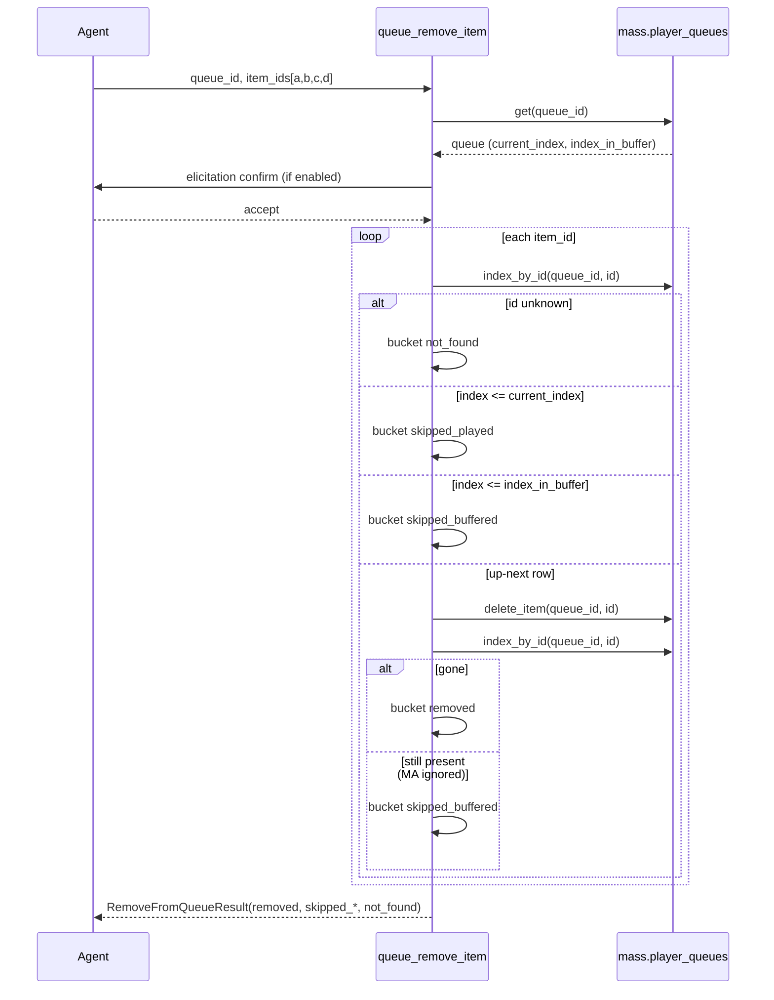

## Problem Statement

Agents can add tracks and clear a whole queue over MCP, but they cannot
**curate** what is already there: dropping specific tracks or moving a row up
/ down / to-play-next requires wiping the queue and rebuilding it. Music
Assistant's native UI has these operations; the MCP surface does not. Worse,
naive removal APIs invite two agent failure modes observed in live testing:
silent no-ops (MA quietly ignores deletes of buffered rows) and stale-id retry
loops (an error midway through a batch hides which rows were already removed).

Ported from upstream PR music-assistant/server **#4410** (steamEngineer),
which could not merge upstream due to recurring forward-sync conflicts. Two
defects found in the upstream implementation are fixed in this port (see
Solution Summary).

## Solution Summary

Three new `queue/*` tools mirroring MA's native `player_queues` API:
`remove_item` (batch removal by `item_id`, destructive, honours the
"Confirm destructive operations" setting, returns a structured
`RemoveFromQueueResult` ack), `move_item` (relative `pos_shift`: -1 up, +1
down, 0 play-next) and `move_item_to_end` — both movers return the reordered
`QueueBrief` so the agent confirms the new order without a second lookup.

Fixes over the upstream diff: (1) an unknown `item_id` no longer aborts the
batch mid-loop (which lost the ack for rows already deleted) — unknown ids are
reported in a new `not_found` bucket; (2) the played/buffered classification
order is corrected (`skipped_played` was unreachable upstream because the
buffer check ran first and `index_in_buffer >= current_index` always holds);
(3) removals are confirmed post-delete via `index_by_id` — MA silently
ignores deletes of buffered rows, so "removed" is verified, not assumed.

## Acceptance Criteria

1. `queue_remove_item(queue_id, item_ids)` deletes every **up-next** row and
   returns it in `removed`; rows at or before `current_index` land in
   `skipped_played`, buffered rows (`<= index_in_buffer`) in
   `skipped_buffered`, unknown ids in `not_found` — no mid-batch exception.
2. A batch containing an unknown id still removes and acknowledges every
   valid id in the same call (regression guard for the upstream ack-loss bug).
3. With `current_index=2`, `index_in_buffer=3`: a row at index 1 is
   classified `skipped_played`, the row at index 3 `skipped_buffered`
   (regression guard for the upstream unreachable-bucket bug).
4. A delete MA silently ignores (row still resolvable via `index_by_id`
   afterwards) is reported as `skipped_buffered`, never as `removed`.
5. `queue_remove_item` is tagged `delete:queue`, annotated destructive, and
   asks for elicitation confirmation when "Confirm destructive operations"
   is enabled; declining leaves the queue untouched.
6. `queue_move_item(queue_id, item_id, pos_shift)` and
   `queue_move_item_to_end` delegate to MA and return the reordered
   `QueueBrief`; MA's `IndexError` / `InvalidDataError` (buffered row,
   unknown id) surface as readable `ToolError`s.
7. Empty `item_ids` and unknown `queue_id` raise `ToolError` before any
   mutation or confirmation prompt.
8. The destructive-operations config description mentions `remove_item`.

## Test Plan

- `test_remove_from_queue.py` (ported + extended): happy path buckets,
  `not_found` bucket, partial-batch ack regression, classification-order
  regression, silently-ignored-delete regression, empty-ids / missing-queue
  errors.
- `test_move_queue_item.py` (ported): delegation to `move_item` /
  `move_item_end`, `QueueBrief` return, ToolError mapping.
- `test_annotations.py`: `queue_remove_item` listed destructive.
- `test_elicitation.py`: confirmation gate accept/decline for
  `queue_remove_item`.
- Manual (optional): remove/move rows on a live queue via MCP client.

## Sequence Diagram

