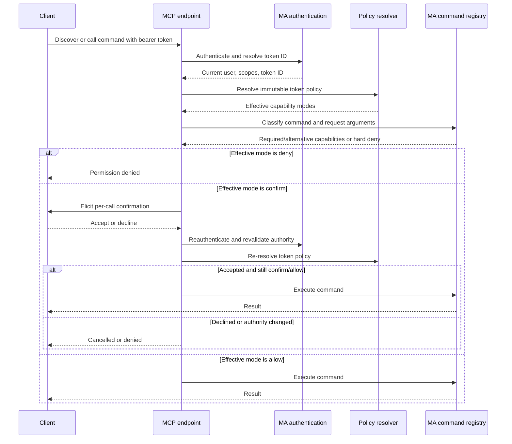

## Problem Statement

MCP access is currently controlled by global capability switches mixed with
command risk and mandatory-confirmation rules. Users cannot give separate
Music Assistant tokens different policies, and destructive or privileged
commands may be gated by classifier-specific behavior instead of one explicit,
auditable capability decision.

## Solution Summary

Introduce 26 stable capabilities with `deny`, `allow`, and `confirm` modes,
five named profiles, and immutable default/per-token policy snapshots. Every
live command is classified into capabilities or hard-denied, and request-time
enforcement resolves the authenticated token's policy, revalidates authority,
elicits confirmation when required, and records redacted audit events. The
existing MCP endpoint and command names remain stable while legacy v1 policy
configuration is intentionally ignored.

## Acceptance Criteria

1. The policy schema exposes exactly the existing 25 capability strings plus
   `system:admin`, and combines required modes with `deny > confirm > allow`.
2. Read-only, Home control, Interactive admin, Trusted, and Custom resolve to
   the documented immutable modes for every capability; omitted Custom entries
   resolve to `deny`.
3. The global default and overrides keyed only by Music Assistant token ID can
   select Inherit, a named profile, or Custom without retaining bearer tokens.
4. Every live Music Assistant command receives one or more capabilities or is
   explicitly hard-denied; unknown commands fail closed and auth/dashboard
   registration families are always denied.
5. Discovery, schema lookup, resources, provider-owned commands, and execution
   use the same freshly resolved request policy, with MA scopes, user state,
   and target filters remaining authoritative upper bounds.
6. A `confirm` command executes only after accepted elicitation and fresh
   revalidation; decline, unsupported clients, revocation, and policy changes
   prevent execution, and confirmation is never remembered.
7. Request-dependent alternatives and secret writes are preflighted before
   execution, resources never bypass confirmation, and impersonation always
   escalates to per-call confirmation.
8. Audits and diagnostics expose effective policy decisions without bearer
   values, token fingerprints, submitted secrets, or unmasked secure config.
9. Missing v2 configuration resolves to Read-only, while v1 permission,
   dynamic API, and mandatory-confirmation keys are ignored without migration.
10. The release remains on `/mcp/v1`, preserves command names, advertises all
    26 capabilities, and identifies the breaking provider version as `2.0.0`.

## Test Plan

- Unit snapshots pin all five profiles across all 26 capabilities, Custom
  defaults, inheritance, token-ID overrides, and mode precedence.
- Registry parity tests use the live command fixture to prove every command is
  capability-classified or hard-denied, including unknown and auth/dashboard
  families.
- Classification tests cover multiple required capabilities, alternative
  capabilities, secret escalation, and absence of risk/mandatory-confirmation
  gates.
- Request integration tests use two tokens for one user and exercise discovery,
  schemas, resources, direct execution, cached cursors, and policy hot-swaps.
- Confirmation tests cover accepted, declined, unsupported, impersonation, and
  every revocation or policy-change revalidation boundary.
- Audit and diagnostics tests verify event content and secret/token redaction;
  configuration tests cover defaults, dynamic token entries, manual IDs, and
  ignored v1 keys.
- Full verification runs pytest, Ruff lint and format checks, mypy,
  pre-commit, and provider-local Docker acceptance when its prerequisites are
  available.

## Sequence Diagram

## Data Model

- `Capability` remains a stable string vocabulary and gains `system:admin`, for
  exactly 26 values grouped under query, control, edit, delete, debug, config,
  and system namespaces.
- `PolicyMode` is a string enum with exactly `deny`, `allow`, and `confirm`.
- `PolicyProfile` identifies exactly Read-only, Home control, Interactive
  admin, Trusted, and Custom.
- An immutable policy maps every capability to one effective `PolicyMode` and
  retains its profile label for discovery, diagnostics, and auditing.
- A policy selection is Inherit, a named non-Custom profile, or Custom with an
  explicit partial capability map; missing Custom entries become `deny`.
- A resolver snapshot contains one default selection and immutable overrides
  keyed by Music Assistant token ID. Raw bearer tokens, bearer hashes, user
  IDs, and client names are not override keys.
- Command classification contains required capability sets plus optional
  request-dependent alternatives and secret-write escalation metadata. Risk
  levels and mandatory-confirmation flags are removed from authorization.
- Runtime identity associates the freshly authenticated user with token ID for
  resolution. Any bounded bearer lookup cache stores only a SHA-256 fingerprint
  mapped to `{user_id, token_id}` and never the bearer itself.
- Audit records contain user, token ID or safe client label, command,
  capability, effective mode, and outcome; sensitive token and secret material
  is excluded.
