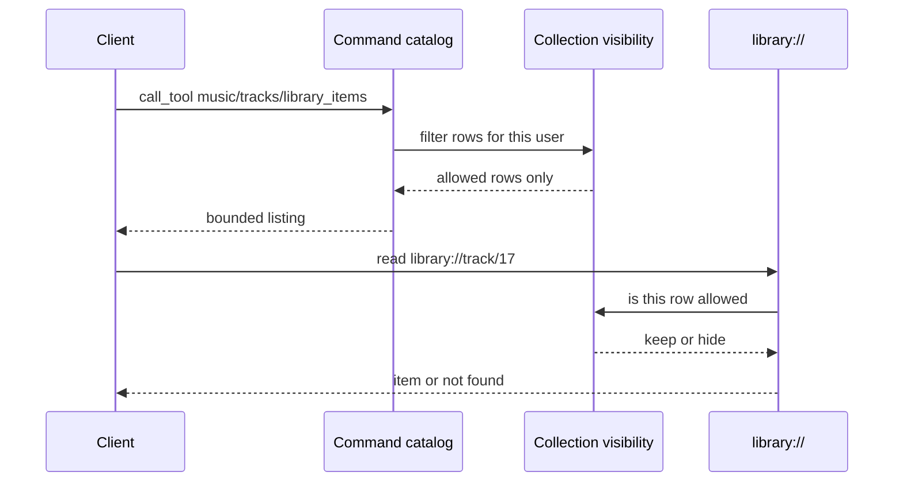

## Problem Statement

A restricted Music Assistant user can still see other people's players and
other providers' library rows depending on which MCP surface they use. Command
listings and `library://` / `player://` / `queue://` resources each apply
filters with their own identity rules, so a new listing command or a new
provider-mapping field has to be patched twice. After the queue-list leak was
closed, the full player list and unscoped search were the same shape of hole.

## Solution Summary

Declare collection visibility once: which listing families are filtered, which
user filter applies, and which fields identify a row. Command results and
resource reads use that declaration. Listings without a declaration pass
through unchanged. Resource confirmation stays deny-to-hide, as required by
permissions v2: resources never bypass confirmation.

## Acceptance Criteria

1. A non-admin user with a player filter does not see other players in the
   full player list or other queues in the full queue list.
2. A non-admin user with a music-provider filter does not see other providers'
   rows in library listings or unscoped search, including items identified
   only through provider mappings.
3. `library://` hides a fetched item if and only if the matching library
   listing command would drop that item for the same user.
4. `player://` and `queue://` still reject URIs outside the player filter.
5. An undeclared listing command returns its native result unfiltered.
6. Admins and users with an empty filter see every row they could see before.
7. Resources whose capability policy is confirm remain hidden; they do not
   execute without elicitation.

## Test Plan

- `test_player_collection_hides_players_outside_the_player_filter` and
  `test_queue_collection_hides_queues_outside_the_player_filter` pin command
  listings.
- `test_library_collection_*` and `test_search_collection_*` pin provider
  identity, including mappings.
- `test_library_resource_and_command_listing_agree_on_row_identity` pins the
  shared seam: one item, one user, same keep/hide on command and resource.
- `test_undeclared_listing_is_not_filtered` pins pass-through.
- Existing `test_player_and_queue_resources_apply_user_player_filter` and
  confirm-hides-resource tests remain green.

## Sequence Diagram

