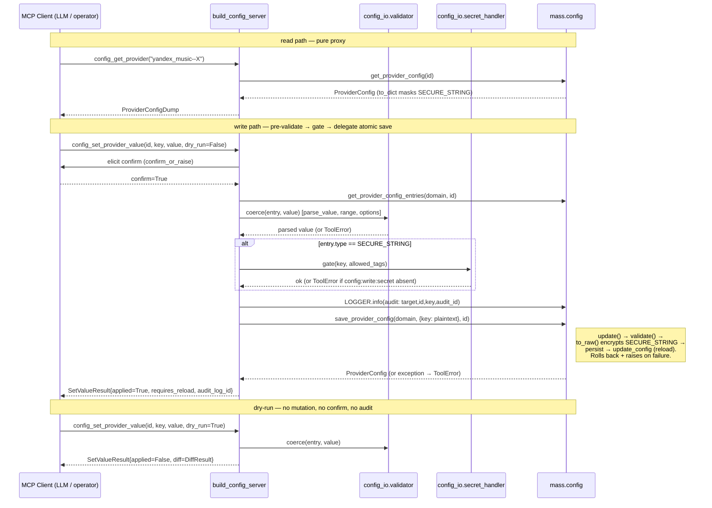

## Problem Statement

The `debug` namespace (spec 0005) lets an operator *read* a provider's
configuration — `debug_inspect_provider_config` dumps the stored
ConfigEntry values with secrets masked. But it is **read-only**, and it
covers providers only. Today, to change any setting an operator must:

- open the Music Assistant web UI by hand (no MCP path), **or**
- stop the server, hand-edit `settings.json` as root, and restart — the
  exact dance this session went through to flip a provider's `log_level`
  to `DEBUG`.

There is no MCP-accessible way to:

- **read core controller config** (webserver, streams, music, players,
  metadata, cache, tasks) — only providers are inspectable today;
- **read per-player config** (volume limits, DSP/EQ, crossfade,
  output protocol) — invisible to MCP;
- **change any setting** — provider, core, or player — from an MCP
  client, even a trusted operator driving an LLM agent;
- **invoke a config action** (a provider's `auth_qr`, `clear_auth`,
  `save_wave_preset` button) without the web UI.

The gap is the write half of configuration plus the read half for core
and player targets. Everything needed is already exposed by MA's
`ConfigController` public API; the provider simply does not surface it
over MCP.

## Solution Summary

Add a tenth FastMCP sub-server, `config`, mounted by `MCPServerRuntime`
alongside the existing nine. It exposes thirteen tools across five new
permission tags — `config:read`, `config:write:provider`,
`config:write:core`, `config:write:player`, and the orthogonal
`config:write:secret` — each gated by its own off-by-default
`ConfigEntry`. Read tools dump provider, core, and player configuration
(reusing 0005's `ConfigValueDump` and MA's `__post_serialize__`
secret-masking — no parallel masking pass). Write tools delegate to MA's public `save_provider_config` /
`save_core_config` / `save_player_config`, which **atomically**
validate (`config.validate()`), encrypt SECURE_STRING values
(via `Config.to_raw()`'s `ENCRYPT_CALLBACK`), persist, and reload the
affected target — rolling back on reload failure for core and player.
The provider therefore performs **no** raw writes and **never** calls
`encrypt_string` itself: plaintext is handed to `save_*_config` and MA
encrypts it on persist. The provider's added value over a bare save is
policy: it pre-validates each value through `ConfigEntry.parse_value()`
for fail-early messages and dry-run diffs, gates SECURE_STRING writes
behind the orthogonal `config:write:secret` tag (MA does not gate
these), elicits confirmation (`confirm_or_raise`), and writes an INFO
audit line (key only, never the value) before the save. A `dry_run`
flag on every set/save returns a before/after diff without mutating,
confirming, or auditing — the preview path. `config_trigger_provider_action` relays a provider's
action handler (e.g. Yandex QR login) and returns the dynamic entries
it produces.

The surface is **stateless** — no ring buffers, no background
subscribers, no locks (MA's `ConfigController` serialises writes
internally and `save_*_config` is atomic with built-in rollback), and
**zero private-API touches**, in contrast to 0005's two carve-outs.
It lands as a single PR, in-tree, intended to be inlined upstream with
the rest of the provider.

## Acceptance Criteria

1. With each of the five new tag-gating `ConfigEntry` booleans left at
   its default (`False`), an in-memory FastMCP `Client` enumerating
   tools sees **zero** entries under the `config` namespace. Enabling a
   single tag exposes only that group's tools. The five keys are added
   to `PERMISSION_KEYS` so a permission-only toggle takes the cheap
   hot-swap path (the defect fixed in spec 0005 Task 1). Pinned by a
   regression test that fails if any config tool leaks through
   `TagFilterMiddleware`.
2. `config_get_provider`, `config_get_core`, and `config_get_player`
   return the stored values for their target with every
   `ConfigEntryType.SECURE_STRING` value replaced by
   `music_assistant_models.constants.SECURE_STRING_SUBSTITUTE` via MA's
   `Config.to_dict()` / `__post_serialize__` hook. The provider carries
   **no** masking logic of its own. A plaintext secret never appears in
   any read response.
3. A write touching a `SECURE_STRING` entry (`config_set_*_value` or
   `config_save_*` whose payload includes such a key) raises `ToolError`
   naming `config:write:secret` **unless** that tag is enabled. The
   check happens during the provider's pre-validation pass, **before**
   any value is handed to `save_*_config`, so plaintext never reaches
   MA's persistence/encryption layer when the gate is closed. The whole
   call is rejected (no partial save through MA) — the provider does not
   split a payload, so a mixed secret+non-secret payload without the
   secret tag fails atomically with the secret key named.
4. When the secret tag **is** enabled, the provider hands the plaintext
   to `save_*_config`, which encrypts it via `Config.to_raw()`'s
   `ENCRYPT_CALLBACK` before writing to storage — the provider itself
   never encrypts, never persists raw, and never logs or returns the
   plaintext. A subsequent read renders the value as
   `SECURE_STRING_SUBSTITUTE`.
5. The provider pre-validates every value through
   `ConfigEntry.parse_value(..., raise_on_error=True)` (type coercion,
   `range`, `options`, provider-defined `validate`) before calling
   `save_*_config`; a failure raises
   `ToolError(f"value for {key!r} failed validation: ...")` and nothing
   is sent to MA. MA's `save_*_config` re-validates authoritatively via
   `config.validate()` — the provider's pass is for fail-early messages
   and dry-run diffs, not a substitute. A bulk save is atomic at MA's
   layer (`config.update()` + `validate()` + `to_raw()` persist happen
   together, with rollback on reload failure for core/player), so a
   single invalid key aborts the whole call with no partial write.
6. `dry_run=True` on any set/save returns the result dataclass with
   `applied=False` and a populated `diff` (key-by-key before/after, with
   SECURE_STRING values shown as `SECURE_STRING_SUBSTITUTE` on both
   sides). No persistence call is made, the confirmation elicitation is
   skipped, and no audit line is written.
7. Every non-dry-run write elicits confirmation via `confirm_or_raise`
   when `require_confirmation=True` (the default). A declined elicitation
   raises `ToolError` and no persistence call is made. Core-config saves
   use a confirmation prompt that explicitly warns the change may restart
   subsystems and interrupt all playback (wider blast radius than a
   single provider).
8. Writes are atomic at MA's layer: `save_*_config` persists and reloads
   the target in one operation, reverting the persisted change and
   raising if the reload fails (verified in MA `save_core_config` /
   `save_player_config`, which roll back to the previous raw config on
   exception). The provider therefore reports a binary outcome —
   `applied=True` on success, `ToolError` on failure — and does not
   expose a separate "persisted-but-reload-failed" state. The result's
   `requires_reload` field is informational: True iff any changed entry
   declared `requires_reload`, so the caller knows a subsystem restart
   was part of the operation.
9. Every non-dry-run write writes exactly one INFO audit line to logger
   `music_assistant.providers.fastmcp_server.config` **before** the
   persistence call, containing `target_type`, `target_id`, the
   key(s), and a sortable `audit_id` that is also returned in the
   result. The audit line never contains a config value (secret or
   otherwise). Dry-run calls write no audit line.
10. `config_trigger_provider_action(instance_id, action_key, values)`
    relays the provider's action handler via
    `mass.config.get_provider_config_entries(..., action=action_key,
    values=values)` and returns the resulting dynamic entries in
    `ActionResult.new_entries`. Action invocation always elicits
    confirmation, even when `require_confirmation=False`.
11. `config_save_*` rejects an input `values` payload whose serialised
    size exceeds 64 KB with `ToolError`, before validation.
12. All config tools raise `fastmcp.exceptions.ToolError` (not bare
    `Exception`) for user-visible error cases, with the offending
    identifier in the message. The full `pytest` suite completes in under
    30 seconds on a clean checkout; no config test starts a real MA
    process.

## Test Plan

- **`tests/test_config_security.py`**
  - `test_off_by_default_hides_all_config_tools` — `mounted_config_off`
    client `list_tools()` returns nothing under `config` (AC #1).
  - `test_enabling_read_tag_exposes_only_read_tools` — only
    `CONFIG_READ` enabled → 6 read tools visible, 0 write.
  - `test_audit_log_written_before_persist` — `caplog` INFO line with
    `target_id` + `audit_id` precedes the `save_*_config` call
    (call-order via `MagicMock.method_calls`).
  - `test_audit_log_contains_no_value` — the set plaintext value is
    absent from `caplog.text`.
  - `test_dry_run_not_audited` — dry-run produces no INFO audit line.
  - Parametrised `test_tool_descriptions_carry_workflow_breadcrumbs` —
    each config tool's description contains its planned cross-references
    (mirrors spec 0005 Task 13 snapshot pinning).

- **`tests/test_config_secret.py`**
  - `test_secret_write_blocked_without_secret_tag` —
    `mounted_config_no_secret`, SECURE_STRING write → `ToolError`
    naming `config:write:secret`; `save_*_config` never called (the
    gate rejects before delegating to MA).
  - `test_mixed_secret_payload_rejected_atomically_without_secret_tag`
    — `{log_level: "DEBUG", token: "x"}` without secret tag → whole
    call raises `ToolError` naming `token`; `save_*_config` never
    called (provider does not split payloads — atomic reject, AC #3).
  - `test_secret_write_delegates_plaintext_and_never_logs_it` — with
    secret tag, `save_provider_config` receives the plaintext value
    (MA encrypts downstream via `to_raw`); the plaintext is absent from
    `caplog.text` and from the returned result (AC #4). The provider
    never calls `encrypt_string`.
  - `test_secret_value_masked_in_diff` — dry-run on a SECURE_STRING →
    `ValueChange.before/after == SECURE_STRING_SUBSTITUTE`; plaintext
    absent from `json.dumps(result)`.

- **`tests/test_config_validator.py`** (pure unit)
  - `test_int_out_of_range_rejected`, `test_string_not_in_options_rejected`,
    `test_type_coercion_str_to_int`, `test_unknown_key_rejected`,
    `test_bulk_fail_early_no_partial_write`.

- **`tests/test_config_differ.py`** (pure unit)
  - `test_diff_computes_before_after_per_key`,
    `test_diff_masks_secret_values`.

- **`tests/test_config_read.py`** — e2e via `mounted_config` Client:
  `config_list_targets`, `config_get_provider/core/player`,
  `config_get_entries`, `config_get_dsp`; assert field presence and
  `ToolError` on unknown ids.

- **`tests/test_config_write_provider.py`**
  - `test_set_provider_value_persists`,
  - `test_dry_run_returns_diff_no_persist` (AC #6),
  - `test_dry_run_skips_confirmation`,
  - `test_requires_reload_triggers_reload`,
  - `test_reload_failure_is_success_path_field` (AC #8),
  - `test_trigger_action_relays_entries` (AC #10),
  - `test_action_always_confirms_even_when_flag_off`.

- **`tests/test_config_write_core.py`**
  - `test_core_save_confirm_prompt_mentions_restart` (AC #7 wider
    blast radius),
  - `test_core_value_set_persists`.

- **`tests/test_config_write_player.py`**
  - `test_set_player_value_persists`,
  - `test_save_dsp_config_persists`,
  - `test_save_payload_over_64kb_rejected` (AC #11).

- **Manual verification step (post-merge, local — MANDATORY).** Spec
  0005 shipped five production bugs that synthetic mocks did not catch
  (absolute imports, hard-coded log root, log-line regex, `mass`/`logger`
  back-references, secret gating) — all surfaced only by live testing
  against a real MA. This spec therefore makes live verification a
  required gate, not an optional note. Against a dev MA instance with
  all five config tags enabled:
  (a) `config_get_core("webserver")` returns the live webserver config;
  (b) `config_get_provider("yandex_music--…")` matches what
  `debug_inspect_provider_config` reports;
  (c) `config_set_provider_value(instance, "log_level", "DEBUG",
  dry_run=True)` returns a diff, then the same call without `dry_run`
  applies it and `debug_inspect_provider_config` confirms the change;
  (d) a SECURE_STRING write without `config:write:secret` is rejected;
  with the tag, the stored value reads back as
  `SECURE_STRING_SUBSTITUTE`, never plaintext.

## Sequence Diagram



## Data Model

### New `Tag` enum members (`provider/tags.py`)

```python
class Tag(StrEnum):
    # ... existing 21 (16 base + 5 debug) ...
    CONFIG_READ          = "config:read"
    CONFIG_WRITE_PROVIDER = "config:write:provider"
    CONFIG_WRITE_CORE    = "config:write:core"
    CONFIG_WRITE_PLAYER  = "config:write:player"
    CONFIG_WRITE_SECRET  = "config:write:secret"   # orthogonal, gates SECURE_STRING writes
```

`CONFIG_TO_TAG` gains five entries; the five new `CONF_CONFIG_*` keys
are added to `PERMISSION_KEYS` (NOT a separate set — they are permission
flags and must take the hot-swap path).

### New `ConfigEntry`s (`provider/config.py`)

Five booleans, `default_value=False`, `category="Config"`, each
`description` warning that enabling exposes configuration mutation over
MCP. `CONFIG_WRITE_CORE`'s description additionally warns core changes
may restart subsystems. `CONFIG_WRITE_SECRET`'s description states it is
required *in addition to* a category write flag for credential writes.
No sixth tuning entry (unlike 0005's buffer capacity).

### Response dataclasses (`provider/models.py`)

`ConfigValueDump` is **reused** from spec 0005 (not redefined). New:

```python
@dataclass(frozen=True, kw_only=True)
class ConfigTarget:
    target_type: str           # "provider" | "core" | "player"
    target_id: str
    domain: str
    name: str
    enabled: bool

@dataclass(frozen=True, kw_only=True)
class ConfigTargetList:
    providers: list[ConfigTarget]
    core: list[ConfigTarget]
    players: list[ConfigTarget]

@dataclass(frozen=True, kw_only=True)
class CoreConfigDump:
    domain: str
    values: list[ConfigValueDump]      # reused from 0005
    truncated: bool

@dataclass(frozen=True, kw_only=True)
class PlayerConfigDump:
    player_id: str
    provider: str
    values: list[ConfigValueDump]
    truncated: bool

@dataclass(frozen=True, kw_only=True)
class ConfigEntryDump:
    key: str
    type: str                          # ConfigEntryType.value
    label: str
    default_value: Any
    required: bool
    description: str | None
    options: list[Any] | None
    range: tuple[int, int] | None
    advanced: bool
    hidden: bool
    requires_reload: bool
    depends_on: str | None
    action: str | None                 # set if entry is an action button
    current_value: Any                 # SECURE_STRING already masked upstream

@dataclass(frozen=True, kw_only=True)
class ConfigEntryList:
    target_type: str
    target_id: str
    entries: list[ConfigEntryDump]
    truncated: bool

@dataclass(frozen=True, kw_only=True)
class DSPBand:
    frequency: float
    gain: float
    q: float

@dataclass(frozen=True, kw_only=True)
class DSPConfigDump:
    player_id: str
    enabled: bool
    bands: list[DSPBand]
    raw: dict[str, Any]                # forward-compat for unknown DSP fields

@dataclass(frozen=True, kw_only=True)
class ValueChange:
    key: str
    before: Any                        # SECURE_STRING → SECURE_STRING_SUBSTITUTE
    after: Any                         # SECURE_STRING → SECURE_STRING_SUBSTITUTE
    secret: bool                       # True iff entry.type == SECURE_STRING

@dataclass(frozen=True, kw_only=True)
class DiffResult:
    target_type: str
    target_id: str
    changes: list[ValueChange]

@dataclass(frozen=True, kw_only=True)
class SetValueResult:
    target_type: str
    target_id: str
    key: str
    applied: bool                      # False when dry_run=True
    requires_reload: bool              # informational: did a changed entry declare it
    audit_log_id: str                  # "" when dry_run=True
    diff: DiffResult | None            # populated when dry_run=True

@dataclass(frozen=True, kw_only=True)
class SaveResult:
    target_type: str
    target_id: str
    applied: bool
    changes: list[ValueChange]
    requires_reload: bool
    audit_log_id: str
    diff: DiffResult | None

@dataclass(frozen=True, kw_only=True)
class ActionResult:
    instance_id: str
    action_key: str
    new_entries: list[ConfigEntryDump]
    extra_data: dict[str, Any]         # action-specific payload (e.g. QR URL)
    audit_log_id: str
```

### New file layout

```
provider/
  tools/
    config.py                  # build_config_server + 13 tool defs
  config_io/
    __init__.py
    validator.py               # coerce(entry, value) -> parsed | ToolError
    secret_handler.py          # SECURE_STRING detection + tag gate (NO encryption — MA's to_raw does it)
    differ.py                  # before/after diff for dry-run (masks secrets)
  models.py                    # +13 dataclasses (ConfigValueDump + ProviderConfigDump reused from 0005)
  config.py                    # +5 ConfigEntry
  tags.py                      # +5 Tag, +5 CONFIG_TO_TAG, +5 in PERMISSION_KEYS
  server.py                    # mount config sub-server (one line; stateless)

tests/
  conftest.py                  # +mounted_config, +mounted_config_off,
                               #  +mounted_config_no_secret, +mock_config_targets
  test_config_read.py
  test_config_write_provider.py
  test_config_write_core.py
  test_config_write_player.py
  test_config_validator.py
  test_config_secret.py
  test_config_differ.py
  test_config_security.py
```

### MA public-API surface consumed (no private touches)

Read: `get_provider_config`, `get_provider_configs`,
`get_provider_config_entries`, `get_core_config`, `get_core_configs`,
`get_core_config_entries`, `get_player_config`, `get_player_configs`,
`get_player_dsp_config`.
Write: `save_provider_config`, `save_core_config`, `save_player_config`,
`save_dsp_config`. These are the **only** write primitives used — each
validates, encrypts (`to_raw`), persists, and reloads atomically with
rollback. The raw setters (`set_raw_*_config_value`) and the standalone
`encrypt_string` are deliberately **not** used: the raw path skips
validation and reload, and encryption is handled inside `to_raw`.
Action: `get_provider_config_entries(domain, instance_id, action=,
values=)`.

**DSP is the one shape exception.** `save_dsp_config(player_id, config)`
takes a typed `DSPConfig` object, not a values dict. `config_save_dsp`
therefore builds it via `DSPConfig.from_dict(payload)` and lets
`config.validate()` (invoked inside `save_dsp_config`) enforce
correctness; an invalid payload surfaces as `ToolError`.

**No private-API carve-outs.** Unlike spec 0005 (which reached into
`mass._load_provider` and `mass.webserver._server`), every call here is
a public, documented `ConfigController` method. Reload is MA's
responsibility inside `save_*_config`; the provider never triggers it
directly.

### Deliberately deferred / out-of-scope

- **Bulk multi-target apply** (one call mutating several providers /
  core domains at once) — each target is its own call; no transaction
  across targets. Revisit if config-as-code import becomes a need.
- **Config history / rollback** — no snapshot-and-revert. The diff is
  forward-only; rollback means issuing the inverse write.
- **Adding / removing provider instances** (provider lifecycle) — this
  spec edits existing configs only. Instance creation/deletion
  (`save_provider_config` for a brand-new instance, `remove_provider_
  config`) is a separate concern.
- **DSP preset management** (`save_dsp_presets`) — only the active DSP
  config is editable here; named-preset CRUD is deferred.
- **Read-audit** — read calls are not audit-logged (gated by
  off-by-default `config:read` already); only writes and actions are.

### Known trust assumption (documented, not defended)

For SECURE_STRING writes, plaintext travels over the MCP transport to
the provider before `encrypt_string` runs. The deployment MUST run MCP
behind TLS or on a trusted local socket. Plain-HTTP MCP that enables
`config:write:secret` is a documented misconfiguration the provider does
not defend against — the secret tag is off by default precisely so this
is an explicit opt-in.
