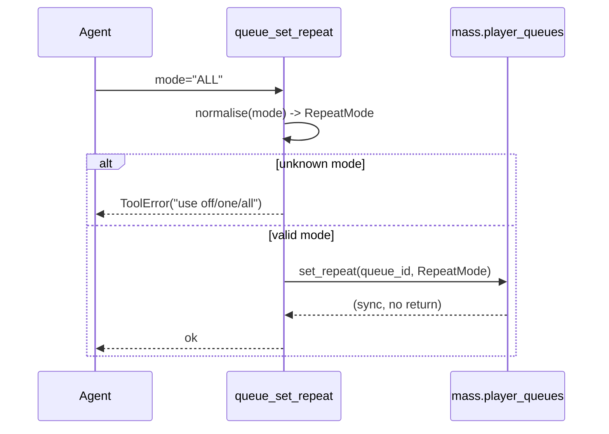

## Problem Statement

Agents driving the MCP server hit three avoidable rough edges:

- There is only a `playback_play_pause` **toggle** — when the current state is
  unknown the toggle flips the wrong way, which LLM agents observe as rapid
  play/pause oscillation. There is no way to *explicitly* pause or resume.
- `players_group_player` can add a player to a sync group, but nothing removes
  it again — the operation is one-way.
- Shuffle is settable (`queue_set_shuffle`) but the sibling queue setting,
  repeat, is not.

These were implemented and tested directly against the upstream inlined copy of
this provider (steamEngineer: #4390, #4391, #4377) and, having merged upstream,
are being adopted here — the canonical source of truth — via the Track A
reverse-sync path before the next forward-sync would otherwise clobber them.

A fourth Track A PR (#4392, queue-lookup ergonomics + `find_and_play` prompt) is
still open upstream and will be reverse-synced separately once it merges.

## Solution Summary

Add three cohesive control-surface improvements, reverse-synced from the merged
upstream PRs and landed together:

- `playback_pause` / `playback_resume` — always pause / always resume, never
  toggle; `play_pause` and `play_media` docstrings steer agents to the explicit
  tools.
- `players_ungroup_player` — removes a player from its sync group (idempotent
  no-op when not grouped).
- `queue_set_repeat` — sets repeat `off` / `one` / `all` (case-insensitive),
  rejecting invalid values with a clear `ToolError`.

## Acceptance Criteria

1. `playback_pause` always calls the non-toggling queue pause; `playback_resume`
   always resumes — neither flips based on current state.
2. `players_ungroup_player` removes the player from any active sync group and is
   a no-op (no error) when the player is not currently grouped.
3. `queue_set_repeat` accepts `off`/`one`/`all` case-insensitively and forwards
   the mapped `RepeatMode`; any other value raises `ToolError` listing the valid
   options (and does not call the MA API).
4. Every new tool carries a permission `tag` (`CONTROL_PLAYBACK`,
   `CONTROL_PLAYERS`, `EDIT_QUEUE`) and is exercised by a test.
5. Upstream authorship is preserved with a `Co-Authored-By: steamEngineer`
   trailer on the commit.

## Test Plan

- `tests/test_playback_tool.py` — `playback_pause` / `playback_resume` forward to
  `player_queues.pause` / `.resume`; `play_pause` still forwards to the toggle.
- `tests/test_players_tool.py` — `players_ungroup_player` forwards to
  `mass.players.cmd_ungroup`; `players_group_player` coverage retained.
- `tests/test_set_repeat.py` — valid modes, mixed case, invalid → `ToolError`,
  and default (`off`). Note: `player_queues.set_repeat` is **sync**, so it is
  mocked with `MagicMock` (not `AsyncMock`) and called without `await`.
- Whole reverse-synced slice green: the 19 tests across the three files pass, and
  `ruff check` / `ruff format --check` are clean.

## Sequence Diagram

The only non-trivial branch is `queue_set_repeat` validating its input before
touching the MA API:

