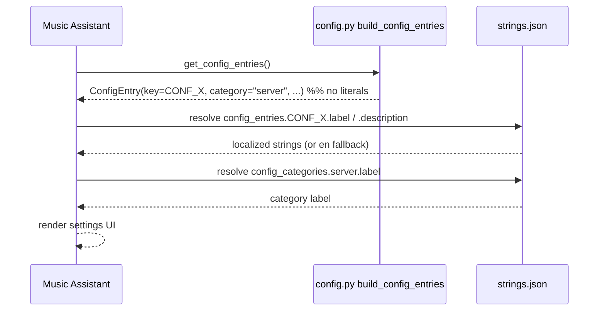

## Problem Statement

The provider authors every `ConfigEntry` `label`, `description`, and `category`
**inline in `provider/config.py`**. This works standalone, but when the provider
is inlined into `music-assistant/server` the upstream `lint` job runs MA core's
`check_config_entries` pre-commit hook, which **rejects hardcoded strings** and
demands they live in the owner's `strings.json`:

```
config.py:111: ConfigEntry 'label' is hardcoded; author it in the owner's
               strings.json (config_entries.<key>.<field>)
config.py:113: ConfigEntry category='Server' is not defined in any strings.json
               config_categories section
```

~30 violations across 11 entries (8 `category="Server"`, 1 `category="Debug"`,
each with a `label` + `description`). A companion hook, `build_translations_source`,
regenerates `music_assistant/translations/en.json` from every provider's
`strings.json`; with no `strings.json` it rewrites `en.json` and fails the lint
run. Both block upstream PR #4486 even after the D213 / test / ruff-format fixes.

This divergence is documented in `CLAUDE.local.md` ("strings.json → inline
`description=` in `config.py` — no file here") and is the last substantive
upstream-conformance blocker.

## Solution Summary

Author a real `provider/strings.json` and have `config.py` reference entries by
key instead of carrying the literals:

1. Add `provider/strings.json` with a `config_entries` map (`<CONF_KEY>.label`,
   `.description`) and a `config_categories` map defining `Server` and `Debug`.
2. Change `config.py` so each `ConfigEntry` omits the inline `label` /
   `description` / `category` literals — MA resolves them from `strings.json` by
   key at load time. The `CONF_*` key constants stay the single source of truth.
3. Verify MA loads `strings.json` for the provider **standalone in this repo**
   (where the package lives at `provider/`, not
   `music_assistant/providers/fastmcp_server/`).
4. Handle the upstream `en.json` regeneration so `build_translations_source`
   finds nothing to write (either the sync regenerates + commits `en.json`, or
   the upstream PR carries it — see Risks).

## Acceptance Criteria

1. `provider/strings.json` exists with a `config_entries` entry (label +
   description) for all 11 config keys and a `config_categories` block defining
   `Server` and `Debug`.
2. `config.py` no longer passes literal `label` / `description` / `category` to
   any `ConfigEntry`; entries resolve their display strings from `strings.json`.
3. The provider still shows correct labels/descriptions/categories in the MA UI
   **running standalone from this repo** (verified in the dev container), i.e.
   strings.json loading is not upstream-only.
4. The full local test suite + `pre-commit` stay green; no user-facing config
   behaviour changes (same keys, defaults, types, permissions).
5. When synced upstream, MA core's `check_config_entries` hook passes (no
   hardcoded-string findings, both categories defined).
6. `build_translations_source` produces no uncommitted `en.json` diff in the
   upstream `lint` job (the regenerated strings are already present).
7. The `CONF_*` constants and `SUPPORTED_FEATURES` are unchanged; the
   `Check feature consistency` workflow stays green.

## Test Plan

- Unit: a test asserts every `CONF_*` key used by `build_config_entries` has a
  matching `config_entries.<key>.label` and `.description` in `strings.json`
  (guards drift between code and strings), and that every category referenced is
  declared in `config_categories`.
- Snapshot / fixture: the rendered config-entries list keeps the same keys,
  defaults, types, and category assignment as before (a behaviour-preserving
  refactor — compare against the pre-migration `syrupy` snapshot).
- Manual (dev container): open the MA UI, confirm the provider's settings render
  the expected labels/descriptions/categories (AC#3).
- Upstream dry-run: re-run "Submit Provider to Upstream" for `fastmcp_server`
  and confirm `check_config_entries` + `build_translations_source` pass.

## Sequence Diagram



## Data Model

`provider/strings.json` (shape mirrors MA core providers):

```json
{
  "config_entries": {
    "<CONF_KEY>": {
      "label": "Human label",
      "description": "Longer help text shown under the control."
    }
  },
  "config_categories": {
    "server": { "label": "Server" },
    "debug":  { "label": "Debug" }
  }
}
```

- Key space: the 11 `CONF_*` constants currently in `config.py` (the 8
  `Server` permission/behaviour toggles, the lean-schema setting, the
  confirmation toggle, and the `Debug` group).
- Category keys are lowercased identifiers (`server`, `debug`); `config.py`
  passes the identifier, `strings.json` carries the display label.

## Spike Findings (2026-06-29)

Investigated MA core + the upstream tree before scoping the implementation:

1. **No runtime `strings.json` loader.** The installed `music_assistant` package
   has no code that reads a provider's `strings.json` at runtime. Strings are a
   build-time source: `build_translations_source` compiles every provider's
   `strings.json` into `music_assistant/translations/en.json`, which MA reads at
   runtime. An **out-of-tree provider's `strings.json` is never compiled into the
   installed MA's `en.json`**, so it would not resolve standalone.

2. **`ConfigEntry.label` is required** (`label: str`) and is the documented
   *fallback* "when no translation for the key is present"; `translation_key`
   (default `settings.{key}`) selects the translation that overrides it. So
   **inline `label` and `strings.json` coexist** — inline is the standalone
   fallback, strings.json/en.json is the upstream translation. Removing inline
   labels would break standalone label display (per finding 1).

3. **Upstream `fastmcp_server` already ships a `strings.json`** and our
   forward-sync (`rsync --delete` of our tree, which lacks the file) **deletes
   it** and reverts `config.py` to our inline-literal form — *that* is why
   `check_config_entries` fails on #4486, not a fundamental incompatibility.

4. **The upstream provider has diverged from this repo.** Its `config.py` builds
   entries via a helper that takes `label`/`category` as **variables** (not
   literals — likely why its inline usage passes the hook), and its
   `config_categories` are permission-themed
   (`query_permissions`, `control_permissions`, `edit_permissions`,
   `delete_permissions`, `mcp_resources`, `mcp_config`) — different from this
   repo's `Server` / `Debug`. Config-entry keys differ too (`open_connect`,
   `require_auth`, `mount_path`, `enforce_audience`, `extra_allowed_origins`).

### Revised strategy (lower risk, additive)

- **Add `provider/strings.json`** (config_entries + config_categories) and
  **keep the inline `label`/`description`** in `config.py` as the standalone
  fallback — additive, no standalone breakage, no runtime-loader dependency.
- Normalise `category` strings to keys (`server`, `debug`) and define their
  labels under `config_categories` so the hook's category check passes.
- The hook flags *hardcoded literals*; mirror upstream's pattern (label/category
  sourced so they pair with a `strings.json` key) so both inline-fallback and
  the hook are satisfied. Confirm against the actual `check_config_entries`
  source before finalising.
- **Reconcile with the upstream-evolved provider first.** Decide whether to
  adopt upstream's diverged `config.py`/`strings.json`/category scheme or
  overwrite it with ours — #4486 currently does the latter, clobbering its
  `strings.json`. This is a prerequisite decision, not a detail.

## Implementation recipe (from upstream's exact pattern)

Diffing the upstream `fastmcp_server` (≈ an older snapshot of *this* config.py +
the conformance work) against ours gives the precise target:

- **Static entries** (open_connect, require_auth, mount_path, require_confirmation,
  enforce_audience, extra_allowed_origins, connect_external_url,
  debug_event_buffer_capacity, **+ our lean_schema**): upstream **omits `label`
  and `description`** on the `ConfigEntry(...)` call; text lives in `strings.json`
  `config_entries.<key>`. `category="server"` / `"debug"` (common categories).
- **Permission entries** (`_bool(...)`): keep the label as a positional arg to
  `_bool` (hidden from the hook, which only flags literals *at a ConfigEntry
  call*), and set `category` to a **granular key** — `query_permissions` /
  `control_permissions` / `edit_permissions` / `delete_permissions` /
  `mcp_resources` / `mcp_config` — each defined in the provider `strings.json`
  `config_categories`.

### Blocker: `ConfigEntry.label` is required in our models pin

Omitting `label` raises `TypeError: missing required keyword-only argument
'label'` against our installed `music_assistant_models` (1.1.126) — `label: str`
has no default. Upstream runs a newer models build where `label` is optional, so
the clean pattern needs a **models-version bump** here first.

### Two implementation options

- **(A) Proper / upstream-aligned.** Bump `music_assistant_models` to a version
  with optional `label` → omit `label`/`description` on static entries → author
  `strings.json`. Matches upstream; strings reach Lokalise. Cost: dependency bump
  (verify such a version exists) + config.py restructure.
- **(B) Loophole / no models bump.** Route **every** entry through a `_bool`-style
  helper so `label`/`category` are always variables at the `ConfigEntry` call
  (the hook only flags literals) → `check_config_entries` passes with no
  strings.json and no models bump. Cost: strings stay English-only (defeats the
  hook intent; upstream reviewers may object); doesn't satisfy
  `build_translations_source`.

### Orthogonal: `build_translations_source` / `en.json`

Either way, the upstream `build_translations_source` hook regenerates
`translations/en.json` from all `strings.json`. After `rsync --delete` removes
upstream's `strings.json`, stale `fastmcp_server` entries left in `en.json` make
the regen diff → hook fails. Fix at the **sync layer** (`ma-provider-tools`):
after rsync, run the translation build and commit the regenerated `en.json`.

## Risks / Open Questions

1. **Standalone loading (highest risk).** Does MA resolve `provider/strings.json`
   when the provider is loaded from this repo's `provider/` path rather than the
   inlined `music_assistant/providers/fastmcp_server/`? If MA keys the lookup off
   the inlined package path, the strings may not load standalone — spike this
   first against the dev container before committing to the migration.
2. **`en.json` flow.** `build_translations_source` regenerates the upstream
   `music_assistant/translations/en.json`. That file is upstream-only
   (`CLAUDE.local.md`: "translations/en.json → n/a → drop the hunk"). The sync
   (`upstream-pr.yml`) likely needs to run the translation build and commit the
   regenerated `en.json` so the upstream hook finds no diff — a companion
   `ma-provider-tools` change, scoped separately.
3. **Reverse-sync mapping.** Update the `CLAUDE.local.md` table: `strings.json`
   becomes a real file, no longer the "inline in config.py" manual map.
4. **Domain.** Manifest domain is now `fastmcp_server` (matches upstream), so
   strings.json keys are consistent across both trees — no rename hazard.
