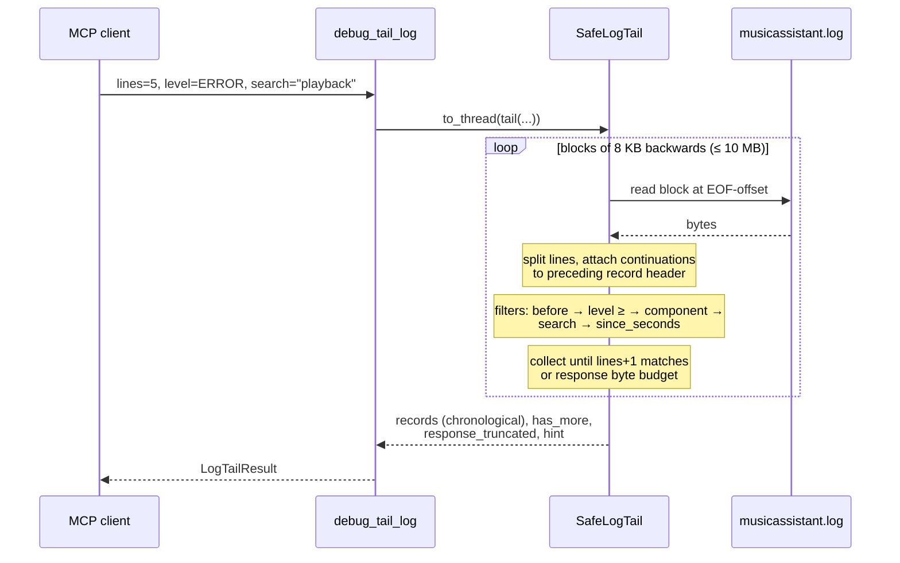

## Problem Statement

`debug_tail_log` truncates to the last N raw lines *before* applying the
`level` / `component_regex` / `since_seconds` filters, so "the last 5 errors"
is not expressible — a rare error in a chatty log is unreachable without
pulling 2000 lines into the LLM context. Multi-line records are split:
a traceback following an `ERROR` line is dropped entirely when filtering by
level, hiding exactly the content needed for debugging. There is no way to
search message text, no bound on the response size (2000 long lines can
exceed the MCP client's tool-result token cap), no way to page into older
entries, and no cheap aggregate view (counts per level/component) to scope a
problem before fetching raw lines.

## Solution Summary

Rework the tail reader to scan backwards record-by-record: lines that do not
start a new log record (tracebacks, wrapped output) are attached to the
preceding record's message. Filters run during the scan, so `lines` counts
*matching records*. New `search` parameter greps the full record text; new
`before` parameter pages into older entries by timestamp. `level` becomes a
case-insensitive minimum-severity threshold. The response is bounded by an
internal byte budget and reports `has_more` / `response_truncated` plus a
ready-to-use next-call hint. A new `debug_log_stats` tool returns per-level
counts, top components and the time range for a window, and
`debug_health_summary` reuses it for its error counter.

## Acceptance Criteria

1. `debug_tail_log(lines=N, level=L)` returns the N most recent records at
   severity ≥ L within the 10 MB scan window, regardless of how many
   non-matching lines follow them in the file.
2. A record's `message` includes its continuation lines (e.g. the full
   traceback); filtering by `level="ERROR"` returns the traceback text.
3. `level` matching is case-insensitive and threshold-based:
   `level="warning"` returns WARNING, ERROR and CRITICAL records; an invalid
   level name raises a tool error listing valid names.
4. `search` filters records by a case-insensitive regex over the full record
   text (header message + continuations); an invalid regex raises a tool
   error naming the parameter.
5. When more matching records exist beyond the returned page (probe one past
   `lines`), `has_more` is `true` and `next_call_hint` contains a
   copy-pasteable follow-up call using `before=<oldest returned timestamp>`;
   when the page is complete the hint is `null`.
6. The cumulative size of returned messages never exceeds the internal
   response budget; when the budget cuts the page short,
   `response_truncated` is `true` and the hint suggests narrowing filters.
7. `before=<ISO timestamp>` returns only records strictly older than the
   given timestamp.
8. `debug_log_stats(since_seconds=S)` returns total record count, per-level
   counts, top components with counts, and first/last timestamps for the
   window, scanning at most the same 10 MB cap.
9. All existing invariants hold: path allowlist, symlink guard, 10 MB scan
   cap, secret redaction, scan runs off the event loop.

## Test Plan

- `test_tail_filter_then_tail_finds_buried_errors` — pins criterion 1 (errors
  buried under hundreds of newer INFO lines are returned).
- `test_tail_groups_traceback_into_error_record` — pins criterion 2.
- `test_tail_level_threshold_case_insensitive` / `test_tail_invalid_level_raises`
  — pin criterion 3.
- `test_tail_search_matches_message_and_traceback` /
  `test_tail_invalid_search_regex_raises` — pin criterion 4.
- `test_tail_has_more_and_next_call_hint` / `test_tail_no_hint_when_page_complete`
  — pin criterion 5.
- `test_tail_response_budget_truncates_with_hint` — pins criterion 6.
- `test_tail_before_cursor_pages_older_records` — pins criterion 7.
- `test_stats_counts_levels_components_and_range` + e2e tool test — pin
  criterion 8.
- Existing security / cap / redaction / threading tests keep passing —
  criterion 9.

## Sequence Diagram

## Notes

- No streaming / follow / resource subscriptions: MCP has no streaming tool
  results and mainstream clients do not surface `notifications/message` or
  `resources/subscribe`; the "live tail" idiom is re-calling with
  `since_seconds` (documented in the tool docstring).
- Schema budget: +2 tail params and +1 tool (`debug_log_stats`) — small
  against the ~20.5k-token catalog; the stats tool follows the
  aggregate-before-raw pattern used by Loki/VictoriaLogs/CloudWatch MCPs.
