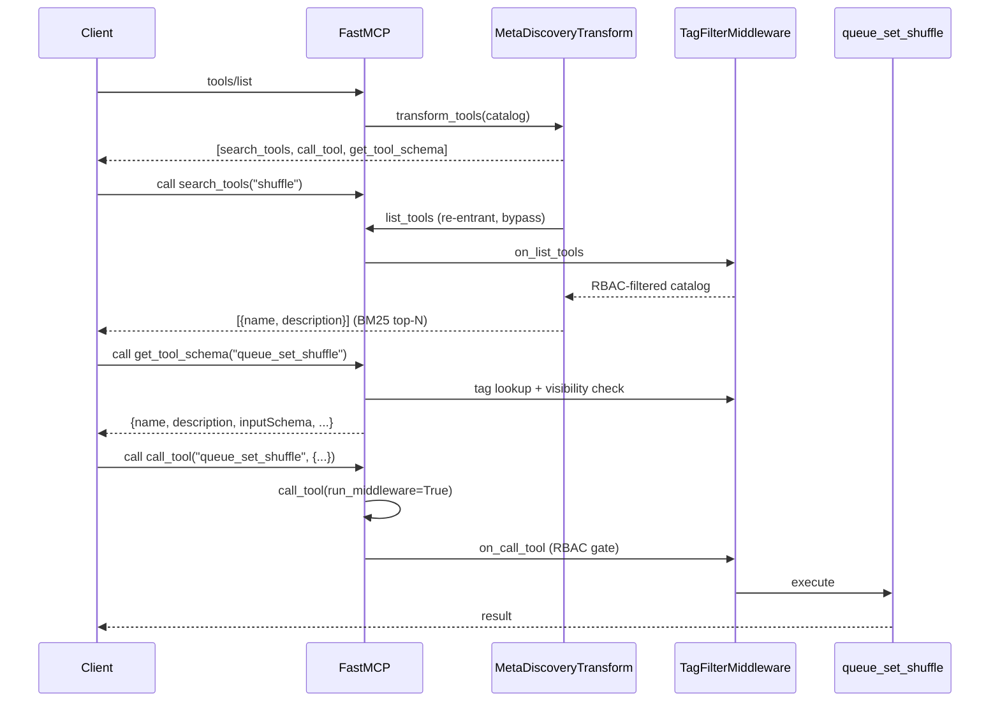

## Problem Statement

The MCP server exposes ~70 tools; hosts that load every tool schema up-front
(OpenClaw, Hermes, OpenCode — unlike Claude, which defers schemas) pay roughly
20k tokens of context on every session before the first request. Operators
of such hosts need a way to trade the full catalog for on-demand discovery
without losing permission enforcement or destructive-action confirmation.

Ported (by concept) from upstream PR music-assistant/server **#4388**
(steamEngineer), which could not merge upstream due to recurring conflicts.
The custom implementation (365-line heuristic ranker with hand-tuned
synonyms / intent boosts / pending-tool-name sets, a bespoke visibility
middleware and schema serializer) is replaced by FastMCP 3.4.4's native
BM25 search transform, as the PR author himself proposed as the long-term
shape.

## Solution Summary

A new boolean config entry **"Simplified tool discovery"** (default off,
hot-swappable). When enabled, `tools/list` returns only three tools:
`search_tools` (BM25-ranked lookup returning lightweight `{name,
description}` results — no inlined schemas), `get_tool_schema` (full
input/output schema for exactly one tool, on demand), and `call_tool` (proxy
that executes any catalogued tool by name). RBAC is preserved end-to-end by
construction: the search catalog is fetched through the middleware pipeline
(`TagFilterMiddleware.on_list_tools` filters it) and the proxy re-enters
`FastMCP.call_tool` with `run_middleware=True` (`on_call_tool` blocks hidden
tools); `get_tool_schema` re-checks tag visibility before serializing.
Destructive-op elicitation still fires through the proxy.

Deliberate divergence from #4388: direct calls to catalogued tools remain
callable in meta mode (FastMCP's hidden-but-callable design) — a stale
client that cached tool names keeps working, and RBAC still applies.

## Acceptance Criteria

1. With the toggle off (default), `tools/list` is unchanged and none of the
   three meta tools appear.
2. With the toggle on, `tools/list` returns exactly `search_tools`,
   `call_tool`, and `get_tool_schema`.
3. `search_tools` returns `{name, description}` entries only — no
   `inputSchema` — ranked by BM25; a query matching a tag-disabled tool
   does not surface it.
4. `call_tool` executes a permitted catalogued tool with the given
   arguments and is rejected (ToolError) for a tag-disabled tool.
5. `get_tool_schema` returns name, description, `inputSchema` (plus
   `outputSchema` / `annotations` when present) for a permitted tool, and
   NotFound for unknown or tag-disabled tools.
6. Destructive-operation confirmation (elicitation) still triggers when a
   destructive tool is invoked through `call_tool`.
7. Toggling the config entry takes effect without a runtime restart
   (hot-swap), in both directions.
8. The config entry appears under the Server category, default off, with
   label/description in `strings.json`.

## Test Plan

- `tests/test_meta_discovery.py`: listing off/on (AC1–2), lightweight +
  RBAC-filtered search (AC3), proxy execution + RBAC block (AC4), schema
  fetch + hidden/unknown NotFound (AC5), elicitation through the proxy
  (AC6), transform-level toggle without rebuild (AC7).
- `tests/test_apply_permission_change.py`: meta-key change hot-swaps (no
  stop/start) (AC7).
- `tests/test_constants.py`: `HOT_SWAPPABLE_KEYS` includes the meta key.
- `tests/test_config_entries.py` pattern: entry present, default off,
  category server (AC8); `tests/test_strings_json.py` covers the new
  strings key automatically if it validates all entries.
- Manual (optional): flip the toggle in MA UI against a live host and run
  search → get_tool_schema → call_tool.

## Sequence Diagram

## Data Model

- **New config key** `meta_tool_discovery` (`ConfigEntryType.BOOLEAN`,
  default `False`, category `server`, advanced) — added to
  `HOT_SWAPPABLE_KEYS`.
- **`search_tools` result shape** (new, wire-level): JSON array of
  `{"name": str, "description": str}` — intentionally schema-free.
- **`get_tool_schema` result shape** (new, wire-level):
  `{"name": str, "description": str, "inputSchema": object,
  "outputSchema"?: object, "annotations"?: object}`.
- No changes to existing dataclasses; no new persistent state. The BM25
  index lives in memory inside the transform and rebuilds lazily when the
  catalog hash changes.
