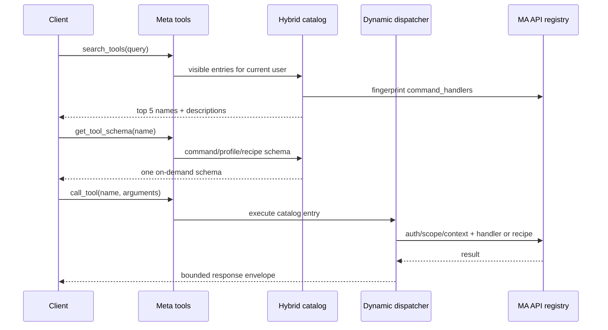

## Problem Statement

The provider exposes a large, hand-maintained tool catalog. MCP clients that load
all schemas spend tens of thousands of tokens before the first useful request,
while newly registered Music Assistant API domains remain unavailable until this
provider adds wrappers for them. The existing optional meta-tool mode reduces the
schema cost but still searches only the provider's static curated tools.

## Solution Summary

Make three meta-tools the permanent MCP surface and build their catalog from
Music Assistant's runtime API-command registry. Official commands are exposed as
`ma_api:<command>` and provider-local composite operations as `mcp_api:<recipe>`.
Known commands receive declarative profiles for compact results, search aliases,
argument conversion and risk overrides. Existing curated handlers are migrated to
profiles or consolidated recipes; their old public names are intentionally
removed. Calls retain MA authentication, scopes, user filters, confirmation and
bounded responses.

## Acceptance Criteria

1. `tools/list` always exposes only `search_tools`, `get_tool_schema` and
   `call_tool`, with a serialized catalog no larger than 3 KiB.
2. Runtime changes to `mass.command_handlers` appear under `ma_api:*` without an
   MCP runtime restart or provider code change.
3. Search returns at most five schema-free results and resolves legacy curated
   terminology to canonical `ma_api:*` or `mcp_api:*` names.
4. Dynamic calls enforce the configured read/control/write/system gates and the
   caller's current MA role, scopes and player/provider filters.
5. Write operations use the configured confirmation policy; system operations
   and impersonation always require confirmation.
6. Compact responses are capped at 25 items / 12 KiB / depth 6; explicit full
   responses are capped at 200 items / 64 KiB / depth 12.
7. Every curated tool present after upstream recommendation sync has a tested
   mapping to a command profile or provider-local recipe, with no loss of its
   operation, compact result, confirmation or dry-run semantics.
8. Old curated names are not callable. When their mapping is unambiguous,
   `call_tool` returns a concise migration hint naming the replacement.
9. When MCP authentication is disabled, dynamic catalog entries are hidden and
   rejected while the MCP endpoint itself remains operational.
10. If the MA registry contract is incompatible, only the dynamic catalog is
    disabled; health diagnostics explain the structural failure.

## Test Plan

- Catalog tests cover the fixed meta surface, token budget, Unicode ranking,
  dynamic registration/unregistration, visibility and legacy search aliases.
- Schema tests cover defaults, enums, unions, collections, impersonation and
  fallback types from real and fake `APICommandHandler` instances.
- Dispatcher tests cover MA authentication, disabled users, scopes, contextvar
  restoration, sync/coroutine/generator handlers, strict arguments and errors.
- Policy tests cover all four risk flags, mandatory system/impersonation
  elicitation and transport-bound exclusions.
- Response tests cover compact/full budgets, projections, deterministic
  truncation and async-generator closing.
- A machine-readable parity matrix covers every removed curated tool and runs
  representative profile/recipe parity cases for each namespace.
- Existing functional tests are retargeted to canonical names and recipes.
- The full pytest, Ruff, mypy, pre-commit and upstream-copy gates pass.

## UX Flows

Discover and invoke an MA capability:

1. Search the current per-user catalog with natural language or a known legacy term.
2. Fetch the schema for one canonical result.
3. Invoke it with compact output by default, optionally requesting projection or full mode.

Use a provider-local composite operation:

1. Search for the goal rather than a former curated tool name.
2. Select an `mcp_api:*` recipe and its operation discriminator when present.
3. Invoke the recipe through the same bounded dispatcher.

No embedded UI is needed: inputs and bounded results are naturally conversational,
while existing MA and MCP clients already provide confirmation interactions.

## Tools and Views

- `search_tools(query)` returns at most five names and descriptions; no schemas.
- `get_tool_schema(tool_name)` returns one live schema, risk and required scope.
- `call_tool(name, arguments, response_mode, fields, max_items)` executes an
  authorized `ma_api:*` command or `mcp_api:*` recipe and returns a bounded envelope.
- No views are registered.

## Sequence Diagram

## Data Model

- `CatalogEntry`: public name, source kind (`ma_api` / `mcp_api`), description,
  schema factory, risk, required scope, visibility and execution target.
- `CommandProfile`: canonical MA command, search aliases, argument converters,
  compact response view, annotations and policy overrides.
- `Recipe`: provider-local schema, required scopes, risk and composite executor.
- `ResponseOptions`: compact/full mode, optional top-level fields and item limit.
- `DynamicResponse`: command, data, truncation flag, counts, encoded byte size and
  applied limits.
- New config booleans: `dynamic_api_read` (default true),
  `dynamic_api_control`, `dynamic_api_write`, `dynamic_api_system` (default
  false). The previous `meta_tool_discovery` entry is retired.
