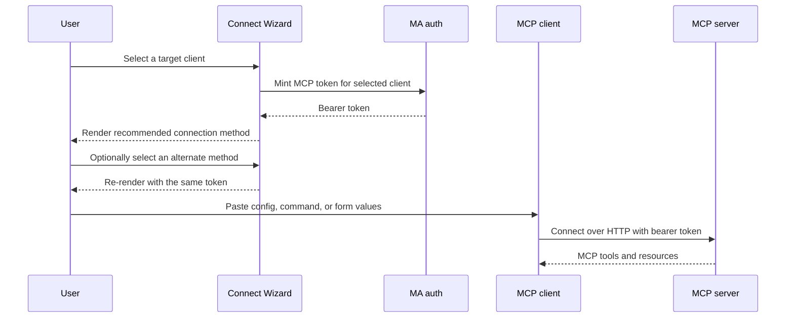

## Problem Statement

The Connect Wizard does not provide onboarding instructions for OpenCode,
OpenHands, or GitHub Copilot CLI. Users of those clients must translate the
Music Assistant endpoint and bearer token into three different configuration
formats, which makes incorrect transports, headers, and file locations likely.
In addition, clients that support more than one setup path are represented by
only one path or would need duplicate client cards, obscuring that the paths
configure the same target application and use the same credential.

## Solution Summary

Add three Connect Wizard presets that reuse the existing per-client token flow:
an OpenCode remote-server JSON configuration, an OpenHands HTTP add command,
and GitHub Copilot CLI `/mcp add` instructions with ready-to-paste form values.
Represent each target client once with an ordered list of connection methods.
The simplest method is first and selected by default, while alternate CLI,
configuration-file, UI, or deeplink methods remain in the same client card and
reuse its token. No MCP runtime or authentication behavior changes.

## Acceptance Criteria

1. The wizard includes an OpenCode preset that renders valid JSON for an enabled
   remote MCP server named `ma` with the selected URL and bearer header.
2. The OpenCode preset disables automatic OAuth because the wizard supplies a
   dedicated long-lived bearer token.
3. The wizard includes an OpenHands command using HTTP transport, server name
   `ma`, the selected URL, and the minted bearer token.
4. The wizard includes GitHub Copilot CLI `/mcp add` instructions with server
   name `ma`, HTTP transport, URL, bearer-header JSON, and all tools enabled.
5. All presets substitute both `{{URL}}` and `{{TOKEN}}`, expose a useful path
   or execution hint, and participate in the existing per-client token flow.
6. The README client list includes OpenCode, OpenHands, and GitHub Copilot CLI.
7. A client with multiple supported setup paths appears once in the client list
   and exposes those paths as ordered methods inside its selected card.
8. The first method is selected by default and identified as recommended; the
   method selector is omitted when a client has only one method.
9. Switching methods reuses the selected client's existing token and does not
   call the token endpoint or revoke credentials.
10. Copy, download, and deeplink actions are shown only when applicable to the
    selected method, and all rendered methods use the current URL mode.
11. Claude Code offers its CLI command before a manual JSON configuration, and
    Cursor offers user configuration before project configuration.
12. Every client in the wizard is checked against current first-party
    documentation, and each supported CLI, configuration-file, UI, or deeplink
    path that accepts the MA URL and bearer header is represented without
    inventing unsupported alternatives.
13. Each method states whether it configures a user/global or project/workspace
    scope when the client distinguishes those scopes.
14. Deprecated transports, obsolete configuration keys, and superseded product
    names are removed from generated snippets.
15. Generated commands and configurations use the advertised Network MCP URL by
    default, while Loopback remains available as an explicit user selection.
16. A Custom client card provides copyable, product-neutral connection
    parameters: server name, Streamable HTTP transport, selected endpoint URL,
    and the complete `Authorization: Bearer` header.
17. Custom participates in the normal per-client token lifecycle, updates when
    Network/Loopback changes, and does not prescribe a configuration syntax.
18. Roo Code is available with its current `streamable-http` configuration for
    both global and project scopes, including the static Bearer header.

## Test Plan

- `test_opencode_template_round_trips` parses the rendered JSON and verifies
  the schema, remote transport, URL, OAuth setting, and bearer header.
- `test_openhands_template_uses_http_transport_and_bearer_header` verifies the
  documented CLI argument order and rendered credentials.
- `test_github_copilot_cli_template_uses_mcp_add_form` verifies the slash
  command and every value required by Copilot CLI's interactive form.
- Catalogue tests verify unique client and method identifiers, non-empty method
  lists, placeholder substitution, and the recommended-first ordering.
- The info endpoint test verifies one client object contains multiple methods
  instead of duplicate client cards.
- The page contract test verifies method selection is client-local, defaults to
  the first method, and never invokes token minting.
- A catalogue snapshot test pins the reviewed method IDs and order for every
  supported client so accidental omissions or obsolete alternatives are visible.
- The page contract test verifies Network is the initial URL mode and its toggle
  is active before any client method is rendered.
- The Custom template test verifies every required connection parameter and
  placeholder is present in the rendered copyable text.
- The Roo Code template test verifies its required transport type, URL, header,
  enabled state, and global-before-project method order.
- Run the complete test suite and repository pre-commit checks.

## Sequence Diagram

## Data Model

- `ClientSpec` continues to own the stable client identifier and label used for
  token naming and deduplication.
- `ClientSpec.methods` is a non-empty ordered tuple of `ConnectionMethod` values.
  Its first item is the recommended method; no duplicate recommendation flag is
  stored.
- `ConnectionMethod` owns a client-local stable identifier, display label,
  snippet syntax, template, path/action hint, notes, filename, and action kind.
- Browser token storage remains keyed only by client identifier. Browser method
  selection is tracked independently and never sent to the token endpoint.
