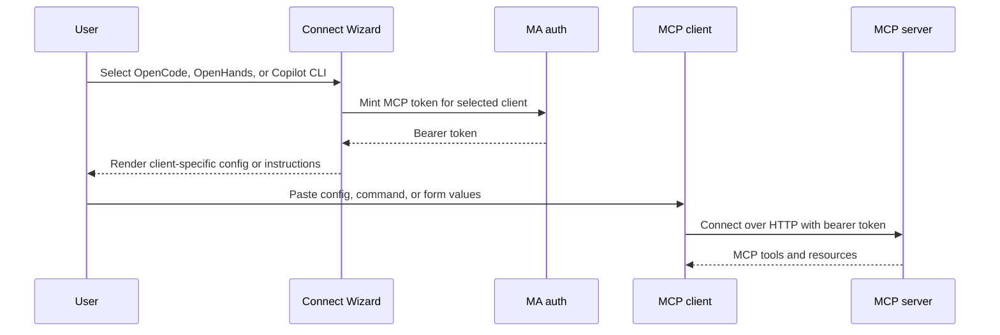

## Problem Statement

The Connect Wizard does not provide onboarding instructions for OpenCode,
OpenHands, or GitHub Copilot CLI. Users of those clients must translate the
Music Assistant endpoint and bearer token into three different configuration
formats, which makes incorrect transports, headers, and file locations likely.

## Solution Summary

Add three Connect Wizard presets that reuse the existing per-client token flow:
an OpenCode remote-server JSON configuration, an OpenHands HTTP add command,
and GitHub Copilot CLI `/mcp add` instructions with ready-to-paste form values.
No MCP runtime or authentication behavior changes.

## Acceptance Criteria

1. The wizard includes an OpenCode preset that renders valid JSON for an enabled
   remote MCP server named `ma` with the selected URL and bearer header.
2. The OpenCode preset disables automatic OAuth because the wizard supplies a
   dedicated long-lived bearer token.
3. The wizard includes an OpenHands command using HTTP transport, server name
   `ma`, the selected URL, and the minted bearer token.
4. The wizard includes GitHub Copilot CLI `/mcp add` instructions with server
   name `ma`, HTTP transport, URL, bearer-header JSON, and all tools enabled.
5. All presets substitute both `{{URL}}` and `{{TOKEN}}`, expose a useful path
   or execution hint, and participate in the existing per-client token flow.
6. The README client list includes OpenCode, OpenHands, and GitHub Copilot CLI.

## Test Plan

- `test_opencode_template_round_trips` parses the rendered JSON and verifies
  the schema, remote transport, URL, OAuth setting, and bearer header.
- `test_openhands_template_uses_http_transport_and_bearer_header` verifies the
  documented CLI argument order and rendered credentials.
- `test_github_copilot_cli_template_uses_mcp_add_form` verifies the slash
  command and every value required by Copilot CLI's interactive form.
- Run the complete test suite and repository pre-commit checks.

## Sequence Diagram

