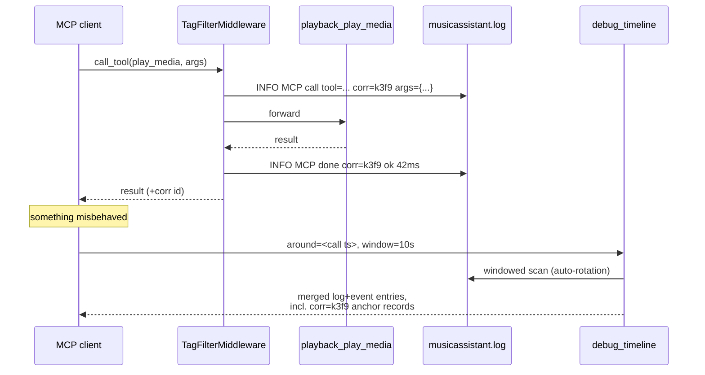

## Problem Statement

The debug namespace is built for troubleshooting Music Assistant, but its two
observability sources cannot be correlated with the user's own actions. An
MCP tool call leaves no trace in the MA log (the middleware only gates
permissions), so "I called `playback_play_media` — what did MA do in
response?" can only be answered by wall-clock guessing. Log queries accept
only a relative `since_seconds`, so a retrospective window ("14:00–14:05
yesterday") is not expressible, and reaching it means manual paging through
rotated files one `name=` at a time. Finally, the log and the event buffer
must be queried separately and merged by the LLM in its own context — slow,
token-hungry and error-prone at window boundaries.

## Solution Summary

Three additions that together make action ↔ log ↔ event correlation a
first-class workflow. (1) The tool-call middleware writes one structured log
record per MCP invocation (tool name, correlation id, argument digest,
outcome, duration) under the provider's component, and the correlation id is
returned to the client, so `debug_tail_log(search="corr=<id>")` yields the
exact slice of MA's reaction to one action; a debug-category config toggle
controls the feature. (2) `debug_tail_log`, `debug_log_stats` and
`debug_recent_events` accept absolute `since`/`until` ISO bounds plus the
ergonomic `around=<ts>` + `window_seconds` form, and a windowed log query
continues transparently across rotated files. (3) A new `debug_timeline`
tool returns one chronological list merging log records and buffered events
for a window, each entry tagged with its source.

## Acceptance Criteria

1. With call logging enabled, every MCP tool invocation produces exactly one
   log record on success containing the tool name, a short correlation id,
   a size-capped argument digest, the outcome (`ok`/`error`) and duration;
   errors add the exception text. Secrets never appear (redaction applies).
2. The correlation id is returned to the MCP client with the tool result, and
   `debug_tail_log(search="corr=<id>")` returns the invocation record (and
   any MA records logged in between, when queried with a window).
3. A `mcp_call_logging` config entry (debug category) enables/disables the
   feature without a provider restart; disabled means zero log writes.
4. `debug_tail_log` accepts `since`/`until` (ISO timestamps) and
   `around` + `window_seconds`; mixing `around` with `since`/`until` is
   rejected with a clear error. The same window vocabulary works on
   `debug_log_stats` and `debug_recent_events`.
5. A windowed `debug_tail_log`/`debug_log_stats` query whose window extends
   past the start of `musicassistant.log` continues into `.log.1` … `.log.5`
   automatically, subject to a total scan cap; the result reports which files
   were scanned.
6. `debug_timeline(since/until|around)` returns one chronologically sorted
   list of entries from both sources, each tagged `log` or `event`, honouring
   `level`/`search` (log side) and `event_types` (event side) filters, with
   the same response-size budget and `next_call_hint` paging as
   `debug_tail_log`.
7. All existing tail invariants hold: path allowlist, per-file scan cap,
   redaction, off-loop scanning, lossless offset paging.

## Test Plan

- Middleware unit tests: one record per call, error path, digest capping,
  redaction of secret-bearing arguments, toggle off ⇒ no writes.
- E2E: call a mutating tool via the in-memory client, then
  `debug_tail_log(search="corr=...")` returns the invocation record.
- Window parsing: `since`/`until`/`around` matrix incl. rejection of
  conflicting params and tz-naive inputs interpreted as local time.
- Rotation continuation: fixture with a window spanning `.log` + `.log.1`
  returns records from both, files listed in the result.
- Timeline: synthetic log + injected events in one window come back merged in
  timestamp order with correct source tags; budget/paging behaviour matches
  tail_log.

## Sequence Diagram

## Data Model

- `LogTailResult` — add `files_scanned: list[str]` (rotation continuation).
- New `TimelineEntry { timestamp, source: "log"|"event", level|event_type,
  component|object_id, message|data-digest }`.
- New `TimelineResult { entries, files_scanned, bytes_scanned,
  scan_truncated, has_more, response_truncated, next_call_hint }`.
- Config: `mcp_call_logging: bool` (category `debug`, default on) in
  `strings.json` + `config.py`; new `Tag` reuse: `DEBUG_LOGS` for
  `debug_timeline` (requires events toggle for the event side).
- Correlation id: short random token per invocation, surfaced in the log
  record and in the tool-result envelope (FastMCP `_meta`).
