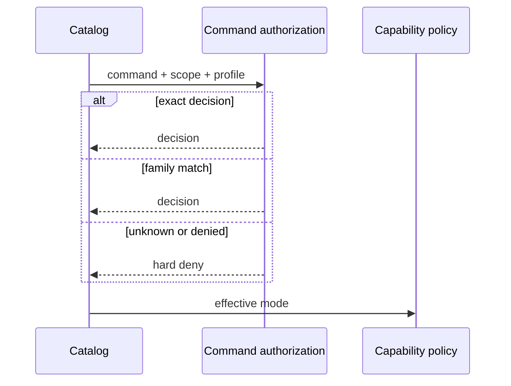

## Problem Statement

Whether a command is playback, volume, a queue edit, or a hard deny is decided
by several tables at once. A new Music Assistant command has to be added in
more than one place or it ships with the wrong capability. Shuffle, repeat, and
save-as-playlist already failed that way.

## Solution Summary

Classify every live command through one lookup: exact decisions first, then
family, then hard deny. Playback, media, and volume controls are exact
decisions, not a second override pass after the family table. The known-command
pin remains a snapshot of Music Assistant's registry, not a second allowlist.

## Acceptance Criteria

1. Playback, volume, and media-control commands resolve to their named
   capability without a post-family override pass.
2. Existing exact decisions (save-as-playlist, group create/remove, debug
   reads, setup flows) keep the same capabilities and annotations.
3. Unknown commands and auth/dashboard registration remain hard-denied.
4. Destructive curated profiles still classify as delete, not edit.
5. Provider-owned `fastmcp/*` commands keep the same capabilities they have
   today.

## Test Plan

- `test_fine_grained_control_commands_use_their_named_capability` remains the
  pin for playback, media, and volume.
- `test_save_as_playlist_requires_the_playlist_edit_capability` and other exact
  pins stay green.
- Command-parity snapshot stays the live-registry contract.

## Sequence Diagram

